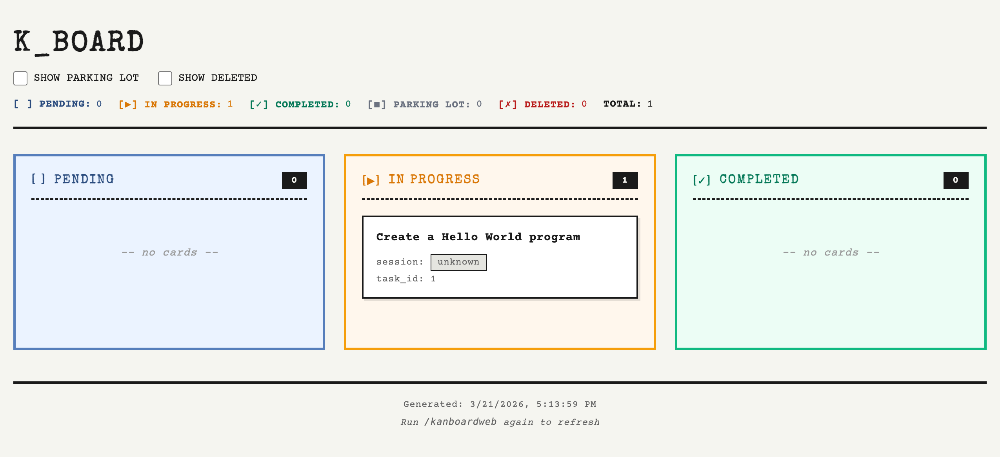

# claude-kan

> Persistent file-based Kanban system for Claude Code with 10+ skills for seamless task management

[](https://www.npmjs.com/package/claude-kan)
[](https://opensource.org/licenses/MIT)

---

## 📋 Purpose

**claude-kan** is a standalone, file-based Kanban system designed specifically for Claude Code users who want persistent task management across coding sessions.

### Why This Exists

When working with Claude Code, tasks and context disappear between sessions. claude-kan solves this by:

1. **Persistent Storage** - Tasks stored as markdown files in `docs/tasks/` organized by status and session
2. **Session Tracking** - Auto-detects Claude Code session IDs to organize work chronologically
3. **Zero Configuration** - Works out of the box with any project (Next.js, React, Node.js, etc.)
4. **Rich Tooling** - 10+ skills for creating, updating, viewing, and managing tasks
5. **Visual Options** - Terminal board, full board, and HTML web view
6. **Git-Friendly** - Markdown files integrate naturally with version control

### Core Features

- ✅ **10+ Skills**: `/kanboard`, `/kancreate`, `/kanupdate`, `/kancard`, `/kanprune`, `/kanboardweb`, etc.
- ✅ **File-Based**: No database required - just markdown files
- ✅ **Session-Aware**: Automatically tracks Claude Code sessions
- ✅ **Multiple Views**: Terminal (compact/full) and HTML web views
- ✅ **Cross-Project**: Install in any JavaScript/TypeScript project
- ✅ **Offline-First**: Works without internet connection
- ✅ **Git Integration**: Track task history with your code changes

---

## 🚀 Quick Start (For Users)

### Installation

```bash
# Install in your project
npx claude-kan init
```

This creates:
- `.claude/skills/` - Skill definitions for Claude Code
- `.kanhelper/` - Compiled system code
- `docs/tasks/` - Task storage with folders for each status

### Natural Language Workflow (Recommended)

Use natural prompts with Claude, and Claude can run the right kanban skill for you:

- "Create a card for implementing OAuth login" → `/kancreate "Implement OAuth login" Add OAuth flow support`
- "Move task 3 to in progress" → `/kanupdate 3 in_progress`
- "Show me the board" → `/kanboard`
- "Show all columns" → `/kanboardfull`
- "Open the web board" → `/kanboardweb`
- "Show card 3" → `/kancard 3`

### Quick Command Reference

**Creating & Managing Cards**
- `/kancreate "subject" description` - Create new task + card
- `/kanupdate {taskId} {status}` - Update card status
- `/kancard {query}` - View individual card details

**Viewing Your Board**
- `/kanboard` - Compact board view (active columns)
- `/kanboardfull` - Full board view (all columns)
- `/kanboardweb` - HTML board that opens in browser

**Maintenance**
- `/kansync` - Manually sync task state
- `/kandoctor` - Run system health check
- `/kanprune` - Delete all cards in `deleted` status

**Status Options**
- `pending` - Tasks waiting to start
- `in_progress` - Active work
- `completed` - Finished tasks
- `parkinglot` - Deferred or blocked
- `deleted` - Deleted tasks

Cards are stored as git-committable markdown files in `docs/tasks/{status}/{session-id}/`.

---

## 🖼️ Screenshot



---

## ⚠️ Limitations

- `Task*` hooks in Claude Code currently do not auto-sync with cards, so some updates are manual.
- `/kanboardweb` generates static HTML and requires regeneration for fresh data.
- Session detection can fall back to `unknown` if Claude's session metadata cannot be detected.
- Designed for individual workflow; it is not a multi-user collaborative board.

---

## 📚 Documentation

- Install with `npx claude-kan init`.
- Run `/kanhelp` to see all available skills.
- Run `/kandoctor` to validate your setup.
- Task files live in `docs/tasks/` in your project.
- **Fast-skills** (zero-token `/kanhelp`) is always on — `init` installs the
  hook automatically. See [docs/FAST_SKILLS.md](docs/FAST_SKILLS.md) for
  details and the diagnostic escape hatch.

---

## 🚢 Releasing (Maintainers)

Releases are automated via scripts in `scripts/`. See [scripts/README.md](scripts/README.md) for full details.

**Prerequisites:** `npm login` and a configured git remote.

```bash
# 1. Verify everything is ready (compiles, required files present, git state)
npm run verify

# 2. Preview the release without publishing
npm run release:dry-run

# 3. Publish (pick one based on the change type)
npm run release         # patch: 1.0.4 → 1.0.5 (bug fixes)
npm run release:minor   # minor: 1.0.4 → 1.1.0 (new features, backward compatible)
npm run release:major   # major: 1.0.4 → 2.0.0 (breaking changes)
```

The release script runs verification, bumps the version in `package.json`, builds, commits the bump, creates a `vX.Y.Z` git tag, publishes to npm with `--access public`, and pushes commits + tags to GitHub.

**After release:**

```bash
npm view claude-kan              # Confirm the new version is live
npx claude-kan@latest init       # Smoke-test the published package
```

Optionally publish a GitHub Release at https://github.com/sudiptosen/claude-kan/releases/new against the new tag.

### Manual patch release (step by step)

If you prefer to run each step yourself instead of `npm run release`, follow these in order. Commands shown bump a **patch** version (e.g. `1.0.4 → 1.0.5`); swap `patch` for `minor` or `major` in step 3 as needed.

1. **Confirm you're logged in to npm**
   ```bash
   npm whoami
   # If this errors, run: npm login
   ```

2. **Start from a clean working tree on `main`**
   ```bash
   git checkout main
   git pull --ff-only
   git status                       # should report "nothing to commit, working tree clean"
   ```

3. **Run pre-release verification**
   ```bash
   npm run verify
   ```
   Fix any reported issues before continuing.

4. **Bump the version in `package.json` (no tag yet)**
   ```bash
   npm version patch --no-git-tag-version
   # Note the new version it prints, e.g. v1.0.5
   ```

5. **Build the package**
   ```bash
   npm run build
   ```

6. **Commit the version bump**
   ```bash
   git add package.json package-lock.json
   git commit -m "Release v1.0.5"
   ```

7. **Create the matching git tag**
   ```bash
   git tag -a v1.0.5 -m "Release v1.0.5"
   ```

8. **Publish to npm**
   ```bash
   npm publish --access public
   ```

9. **Push the commit and tag to GitHub**
   ```bash
   git push origin main
   git push origin --tags
   ```

10. **Verify the release**
    ```bash
    npm view claude-kan version     # should print 1.0.5
    npx claude-kan@1.0.5 init       # smoke-test in a scratch directory
    ```

**If `npm publish` fails after you've already committed and tagged:** don't reset. Fix the underlying problem (auth, network, registry), then re-run only step 8 followed by step 9. The commit and tag are already correct for the version being published.

---

## 📄 License

MIT License - See [LICENSE](LICENSE) file for details.

---

## 🔗 Links

- **npm Package**: https://www.npmjs.com/package/claude-kan
- **GitHub Repository**: https://github.com/sudiptosen/claude-kan
- **Issue Tracker**: https://github.com/sudiptosen/claude-kan/issues
- **Claude Code**: https://claude.ai/code

---

## 💬 Support

- **Issues**: [GitHub Issues](https://github.com/sudiptosen/claude-kan/issues)
- **Discussions**: [GitHub Discussions](https://github.com/sudiptosen/claude-kan/discussions)

---

**Built with ❤️ for Claude Code users who want persistent task management**
